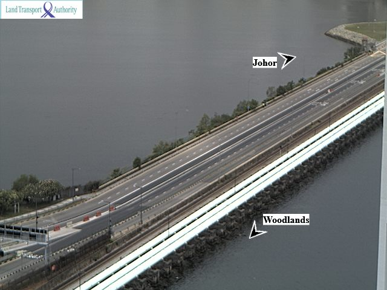
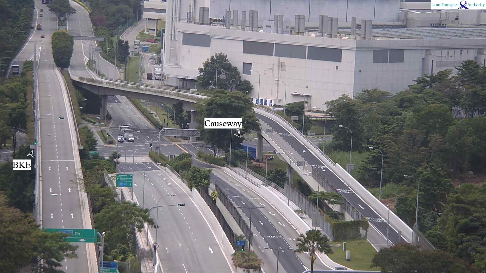
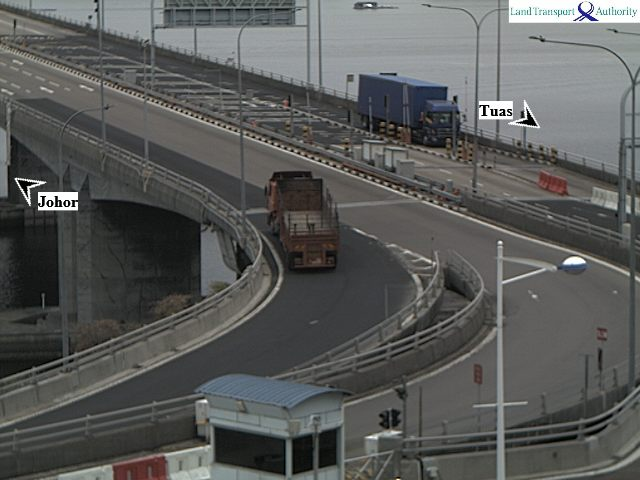
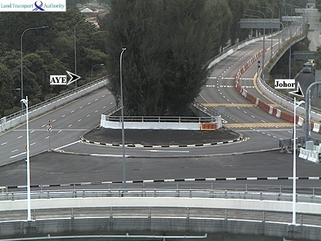

# wdl-tuas-images
Python scripts to download images from the [Onemotoring website](https://www.onemotoring.com.sg/content/onemotoring/home/driving/traffic_information/traffic-cameras/woodlands.html), add timestamps on each frame and rename them to be stitched together into a video using ffmpeg.

# Watch the videos
* Compilation of all four cameras https://www.youtube.com/watch?v=EzHAmMd8jGg
* Side-by-side video of the Woodlands Causeway https://www.youtube.com/watch?v=AnGHnB1fAio

# Download images
Download the traffic camera images here
https://app.box.com/s/jwm5jshe8cubbqgbc3lruppcd8hm0kq3

# Camera IDs
2701: Woodlands Causeway Towards Johor

2702: Woodlands Checkpoint (Towards BKE)

4703: Tuas Second Link

4713: Tuas Checkpoint

# Background
On 18 March 2020, Malaysia implemented travel restrictions in response to COVID-19. As a result, traffic volumes at the two border crossings between Singapore and Malaysia (Woodlands Causeway and Tuas Second Link) decreased drastically, except for a handful of goods vehicles carrying essential cargo. This timelapse is made from publicly available traffic images provided by the Land Transport Authority. The images were collected from 9pm, 19 March 2020 to 9pm 20 March 2020, capturing a moment in history when the causeway fell (relatively) silent.
